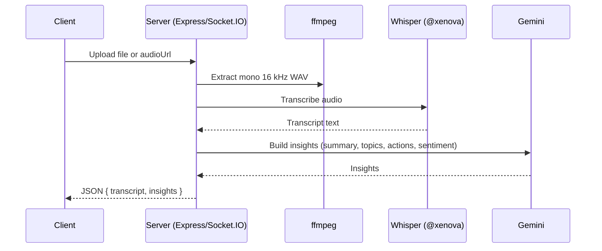

## 🎧 EchoScribe API (Audio Transcription & Insights)

Production-ready Node.js service for ingesting audio (file uploads or remote media URLs), extracting audio, transcribing speech locally via Whisper (Xenova), and generating summaries, topics, action items, and sentiment using Google Gemini.

### ✨ Features
- **Audio ingestion**: Upload audio directly or provide a remote media URL to download and process.
- **Audio extraction**: Uses ffmpeg to extract mono 16 kHz PCM WAV from any media.
- **Local transcription**: Runs Whisper (via `@xenova/transformers`) in-process. No external ASR required.
- **AI insights**: Summaries, topical tags, action items, and sentiment via Google Gemini.
- **Realtime over WebSocket**: Stream chunks, receive partial transcripts, then a final insights payload.
- **Stateless by default**: No DB included; persist results in your own system.

## 🛠️ Tech Stack

| Area | Technology | Notes |
| --- | --- | --- |
| Runtime | Node.js 18+ | Requires native `fetch`, `Web Streams` |
| HTTP server | Express | REST endpoints for uploads and finalize |
| WebSocket | Socket.IO | Realtime streaming of audio chunks and events |
| File upload | express-fileupload | Multipart form-data handling |
| Transcription | @xenova/transformers (Whisper-tiny) | Local ASR; configurable model |
| Audio tools | ffmpeg / ffmpeg-static | ffmpeg-static used if available, else system ffmpeg |
| Summarization | @google/generative-ai (Gemini) | Uses `GEMINI_API_KEY` |

## 🏗️ Architecture & Workflow

1) Client sends either an audio file or a remote media URL.
2) Server ensures WAV mono 16 kHz using ffmpeg (`extractAudio`).
3) Whisper transcribes to text locally.
4) Gemini generates summary, topics, action items, and sentiment.
5) Response returned over REST, or emitted as Socket.IO events for realtime sessions.

Sequence (high-level):



## ⚙️ Environment Variables

- `API_BEARER_TOKEN` (optional but recommended): Shared secret for REST and WebSocket auth
- `GEMINI_API_KEY` (required for insights): Google Generative AI key
- `GEMINI_MODEL` (optional): e.g., `gemini-1.5-flash`

## 🔐 Authentication

### REST
Provide a bearer token in the `Authorization` header if `API_BEARER_TOKEN` is set.

```
Authorization: Bearer <API_BEARER_TOKEN>
```

### WebSocket (Socket.IO)
Provide the token in the connection `auth` payload.

```js
const socket = io("http://localhost:3000", {
  auth: { token: "<API_BEARER_TOKEN>" },
});
```

If the token is missing or invalid when `API_BEARER_TOKEN` is set, the server returns `unauthorized` and disconnects.

## 📡 REST API

### POST /upload-audio
Process an uploaded audio file or a remote URL. Returns transcript and insights.

- Accepts either:
  - `multipart/form-data` with field `audio` (file)
  - `application/json` with `{ "audioUrl": "https://..." }`

Request (file upload):

```bash
curl -X POST http://localhost:3000/upload-audio \
  -H "Authorization: Bearer $API_BEARER_TOKEN" \
  -F "audio=@/path/to/audio.webm"
``;

Request (remote media URL):

```bash
curl -X POST http://localhost:3000/upload-audio \
  -H "Authorization: Bearer $API_BEARER_TOKEN" \
  -H "Content-Type: application/json" \
  -d '{"audioUrl":"https://example.com/media.mp4"}'
```

Success response:

```json
{
  "success": true,
  "transcript": "...",
  "insights": {
    "summary": "...",
    "topics": ["..."],
    "action_items": ["..."],
    "sentiment": { "label": "neutral", "score": 0.5 }
  }
}
```

Errors:

```json
{ "error": "missing_audioUrl_or_audio" }
{ "error": "process_failed" }
```

### POST /api/finalize
Optionally finalize by combining an existing transcript with an uploaded audio file chunk. Returns `audioId`, combined transcript, and insights.

Body:

- `multipart/form-data` with optional `audio` (file) and fields:
  - `audioId` (optional string)
  - `transcript` (optional string)

Example:

```bash
curl -X POST http://localhost:3000/api/finalize \
  -H "Authorization: Bearer $API_BEARER_TOKEN" \
  -F "audio=@/path/to/clip.wav" \
  -F "audioId=session-123" \
  -F "transcript=previous text"
```

Success response:

```json
{
  "success": true,
  "audioId": "rest-1712345678901",
  "transcript": "...",
  "insights": {
    "summary": "...",
    "topics": ["..."],
    "action_items": ["..."],
    "sentiment": { "label": "neutral", "score": 0.5 }
  }
}
```

Errors:

```json
{ "error": "finalize_failed" }
```

## 🔌 WebSocket API (Socket.IO)

Connect:

```js
import { io } from "socket.io-client";

const socket = io("http://localhost:3000", {
  auth: { token: "<API_BEARER_TOKEN>" },
});

socket.on("connect", () => console.log("connected"));
socket.on("error", (e) => console.error("socket error", e));
```

Events (Client -> Server):

- `start_audio` `{ audioId?: string, audioName?: string }`
- `audio_chunk` `{ buffer: ArrayBuffer|Uint8Array, ext?: string }`
- `end_audio` `{}`

Events (Server -> Client):

- `audio_started` `{ audioId: string, audioName?: string }`
- `partial_transcript` `{ text: string }`
- `audio_final` `{ audioId: string, transcript?: string, insights?: object, error?: string }`

Minimal example:

```js
socket.emit("start_audio", { audioName: "Call with Alice" });

// For each chunk (webm/ogg/wav/etc.)
socket.emit("audio_chunk", { buffer: someArrayBuffer, ext: "webm" });

socket.emit("end_audio");

socket.on("partial_transcript", ({ text }) => console.log("partial:", text));
socket.on("audio_final", (payload) => console.log("final:", payload));
```